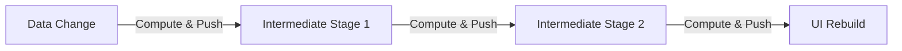
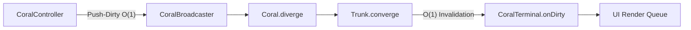
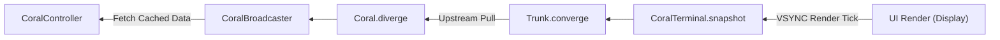

# Coralline Ecosystem

[](https://pub.dev/packages/coralline)
[](https://pub.dev/packages/coralline_extensions)
[](https://pub.dev/packages/coralline_flutter)
[](LICENSE)
[](https://flutter.dev)
[](https://dart.dev)

> **"Don't write boilerplates. To handle complex reactive pipelines, all you have to do is call a line (Coralline)."**  
> *Stop tangling your logic wires—a composable pipeline for reactive structures. Simply call a line.*

**Coralline** is a high-performance, zero-overhead Dart & Flutter reactive state management framework powered by **CORAL** (**C**hain **o**f **R**eactivity **A**nd **L**azy-computation). Designed to solve computational flooding and verbosity in state management, Coralline models state processing after Flutter's `RenderObject` pipeline: **Push-Dirty ($O(1)$) + Pull-Data (Lazy)**.

<br>

---

## 📦 Packages in this Repository

| Package | pub.dev | Description |
| :--- | :--- | :--- |
| [**`coralline`**](coralline/) | [](https://pub.dev/packages/coralline) | Pure Dart core engine implementing the Chain of Reactivity and Lazy Computation pipeline architecture. |
| [**`coralline_extensions`**](coralline_extensions/) | [](https://pub.dev/packages/coralline_extensions) | Official extension library for reactive operations on Dart `Future`, `Stream`, `Iterable`, and `List`. |
| [**`coralline_flutter`**](coralline_flutter/) | [](https://pub.dev/packages/coralline_flutter) | High-performance Flutter state management framework with zero-allocation single-dependency components and $O(1)$ context resolution. |

<br>

---

## 💡 Why Coralline?

Traditional push-based reactive frameworks (e.g., standard Streams or Signals) continuously flood heavy data payloads downstream on every mutation.



**Coralline** decouples dirty notification from data computation into two distinct phases:

### Phase 1: Push-Dirty (COR: Chain of Reactivity)

*(No data computation or memory allocation occurs during state mutation; only a lightweight $O(1)$ dirty flag is broadcast)*

### Phase 2: Pull-Data (AL: And Lazy-computation)

*(Data computation occurs strictly on demand during frame rendering, caching intermediate results automatically)*

<br>

---

## 🚀 Quick Start (Flutter)

Add `coralline_flutter` to your `pubspec.yaml`:

```yaml
dependencies:
  flutter:
    sdk: flutter
  coralline_flutter: ^0.1.0
```

### 1:1 Inline Reactive Widget Example

```dart
import 'package:flutter/material.dart';
import 'package:coralline_flutter/coralline_flutter.dart';

void main() => runApp(CounterApp());

class CounterApp extends StatelessWidget {
  CounterApp({super.key});

  final counterController = CoralController<int>(0);

  @override
  Widget build(BuildContext context) {
    return MaterialApp(
      home: Scaffold(
        appBar: AppBar(title: const Text('Coralline Counter Example')),
        body: Center(
          child: counterController.provider.coral
              .map((count) => Text(
                    'Count: $count',
                    style: const TextStyle(fontSize: 28, fontWeight: FontWeight.bold),
                  ))
              .toWidget(),
        ),
        floatingActionButton: FloatingActionButton(
          onPressed: () => counterController.set(counterController.data + 1),
          child: const Icon(Icons.add),
        ),
      ),
    );
  }
}
```

<br>

---

## 📚 Technical Documentation & Manuals

Explore the in-depth documentation in the [`coralline/doc/manual`](coralline/doc/manual) directory:

1. 🚀 [**Quickstart & Core Concepts Guide**](coralline/doc/manual/01_quickstart_and_concepts.md) — Build your first reactive pipeline in 5 minutes.
2. 🔀 [**Pipeline & Broadcasting Guide**](coralline/doc/manual/02_pipeline_and_broadcasting.md) — Master 1:N sharing (`CoralBroadcaster`), dynamic topology (`CoralCoupler`), and snapshots.
3. 📖 [**Public API Reference Manual**](coralline/doc/manual/03_public_api_reference.md) — Complete catalog of all public Classes, Mixins, and Extensions.
4. 🔬 [**Flutter & Dart Engineering Whitepaper**](coralline/doc/manual/04_flutter_dart_engineers_whitepaper.md) — Deep technical analysis of Push-Dirty Pull-Data, Fasttrack $O(1)$, and Wasm performance.

<br>

---

## 📄 License

Coralline ecosystem libraries are licensed under the [Apache License 2.0](LICENSE).
