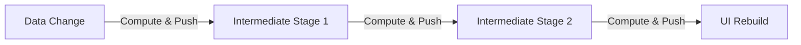
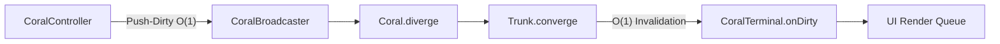
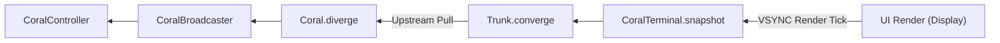
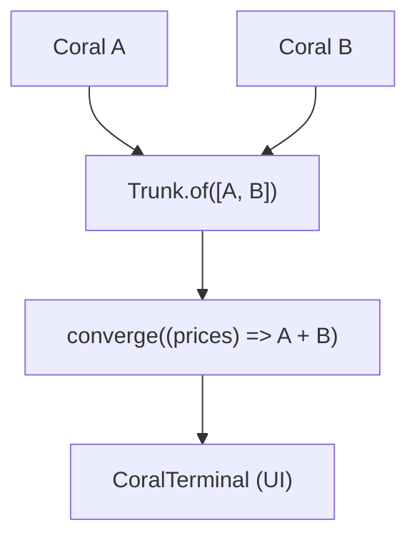
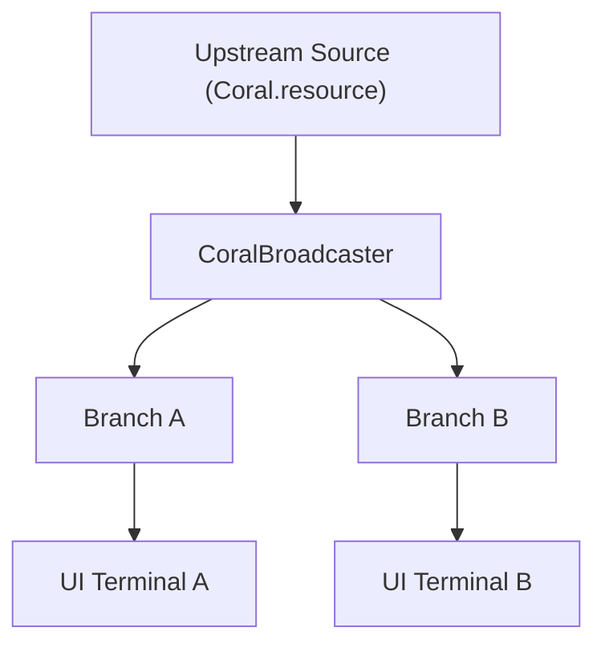
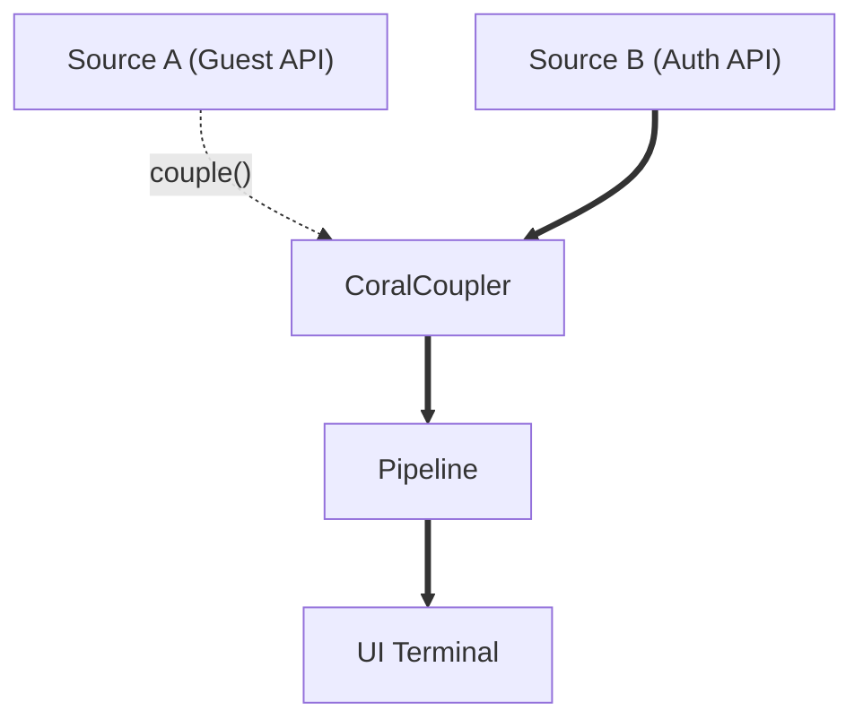

# Coralline

[](https://pub.dev/packages/coralline)
[](LICENSE)
[](https://dart.dev)

> **"Don't write boilerplates. To handle complex reactive pipelines, all you have to do is call a line (Coralline)."**  
> *Stop tangling your logic wires—a composable pipeline for reactive structures. Simply call a line.*

**Coralline** is an elegant, zero-overhead Dart reactive pipeline engine based on **CORAL** (**C**hain **o**f **R**eactivity **A**nd **L**azy-computation). Designed to solve the computational flooding and verbosity of modern Flutter state management libraries, Coralline powers state management with the exact same architecture as Flutter's `RenderObject` rendering engine: **Push-Dirty, Pull-Data**.

<br><br>

### 💡 Why Coralline?

Traditional push-based reactive frameworks (e.g., standard Streams) continuously flood heavy data payloads downstream to every pipeline stage whenever upstream data mutates.



*(Intermediate computations & object allocations executed immediately on every mutation)*

<br>

**Coralline** solves this problem with elegance:

#### Phase 1: Push-Dirty (COR: Chain of Reactivity)

*(No data computation or allocation; only broadcasts an O(1) dirty flag down the Chain of Reactivity)*

<br>

#### Phase 2: Pull-Data (AL: And Lazy-computation)

*(Triggers backward Pull from Terminal up to Source ONLY during VSYNC render tick to compute exactly ONCE)*

1. **Push-Dirty ($O(1)$ Invalidation)**: When a state source changes, Coralline broadcasts a lightweight, dirty flag down the DAG graph. **No actual data is computed or pushed.**
2. **Coalescing Buffer**: Multiple synchronous state mutations within the same event loop are coalesced into a single invalidation frame, eliminating mid-frame layout thrashing.
3. **Pull-Data (Strictly Lazy Computation)**: Intermediate transformations (`map`, `derive`, `aggregate`) are executed **only when the UI Terminal explicitly requests `.snapshot` or `.data`**.
4. **Fasttrack Direct Pointer Bypass**: Topology resolution is pre-cached ($O(1)$ direct jump), bypassing $O(d)$ parent-chain traversals during runtime state updates.

<br><br>

### ⚡ 15-Second Quick Start

#### 1. Counter Pipeline

```dart
import 'package:coralline/coralline.dart';

void main() {
  // 1. Create a reactive controller (Source)
  final controller = CoralController<int>(0);

  // 2. Build a lazy transformation pipeline ("Call a line")
  final doubleCoral = controller.coral.map((count) => count * 2);

  // 3. Connect and activate a terminal (Destination)
  late final CoralTerminal<int> terminal;
  terminal = doubleCoral.toTerminal(() {
    print('Doubled count is: ${terminal.data}');
  });
  terminal.activate();

  // 4. Update data imperatively
  controller.set(1); // Output: Doubled count is: 2
  controller.set(5); // Output: Doubled count is: 10
}
```

#### 2. Async Data & Pattern Matching

```dart
final searchController = CoralController<String>('');

// Async pipeline with cascade and toCoral()
final searchResults = searchController.coral.cascade((query) {
  return fetchSearchResults(query).toCoral();
});

late final CoralTerminal<String> terminal;
terminal = searchResults.toTerminal(() {
  switch (terminal.snapshot) {
    case CoralSnapshotValid(:final data):
      print('Results: $data');
    case CoralSnapshotEmpty():
      print('Type a search query...');
    case CoralSnapshotDamaged(:final error):
      print('Error loading results: $error');
  }
});
terminal.activate();
```

> 💡 **Tip: Do I need to write a `switch` statement for every snapshot?**  
> Not at all! For routine UI displays or fallback defaults, ergonomic accessors handle it in a single line:
> - **Fallback Default Value**: `final count = terminal.snapshot.dataOrElse(() => 0);`
> - **Null Operator Convenience**: `final text = terminal.snapshot.dataOrNull?.toString() ?? 'Loading...';`
> - **Direct Access on Guaranteed Sources**: `final data = controller.coral.data;`

<br><br>

### 🔄 Coralline & Dart Stream (Complementary Architecture)

> **"Can Coralline completely replace Dart `Stream`s?"**  
> **Answer:** Coralline does not view `Stream`s as a target for total replacement. Instead, it advocates an elegant **separation of concerns and complementary relationship**: `Stream` for low-level asynchronous event collection, and `Coralline` for lazy UI state transformations and computation pipelines.

#### 1. Architecture & Feature Comparison

| Dimension | Dart `Stream` | `Coralline` |
| :--- | :--- | :--- |
| **Reactive Paradigm** | **Eager Push Model**<br>(Heavy payloads emitted downstream immediately on mutation) | **Push-Dirty, Pull-Data**<br>($O(1)$ Dirty flag push, synchronous lazy pull on demand) |
| **Execution Timing** | **Eager Computation**<br>Intermediate `map`/`where` & allocations run immediately | **Lazy Computation**<br>Computed exactly ONCE when UI renders, cached until dirty |
| **Sync vs Async** | **Async Event Loop**<br>Bound to microtask queue; 1-frame latency potential | **Synchronous Pure Computation**<br>Pipeline executes synchronously for 0ms UI frame rendering |
| **Frame Coalescing** | **Manual Operators Required**<br>Requires `debounceTime` for multi-mutations in 1 frame | **Automatic Frame Coalescing**<br>100 mutations in 1 frame computed exactly ONCE on render |
| **State & Error** | **Separated Event + `onError`**<br>Ambiguous whether `null` means loading or data | **`CoralSnapshot` Boxing**<br>`Valid`, `Empty`, `Damaged` containers with fail-fast safety |
| **Multi-Source Union** | **Complex Stream Combination** | **Native `Trunk.of([...]).converge(...)` Support** |
| **1:N Multicasting** | **`BroadcastStream`**<br>Manual listener tracking & cleanup required | **`CoralBroadcaster`**<br>Smart reference counting & **Lazy Deactivation** (zero hot-reload flicker) |
| **Runtime Source Swapping** | **Requires Teardown & Re-subscribe** | **`CoralCoupler`**<br>Runtime `Coldswap` / `Hotswap` sockets preserving downstream |

#### 💡 Role Allocation Guide

1. **Areas Where Coralline Replaces Stream (Highly Recommended)**
   - **UI State Management & Reactive Pipelines**: Replaces legacy `Stream` or `StreamBuilder` pipelines used for data transformation and UI feeding.
   - **Multi-Source Combination & Form Validation**: Business logic deriving final state from multiple fields or input streams.
2. **Areas Where Stream is Retained alongside Coralline (Complementary)**
   - **Low-Level Asynchronous Event Ingestion**: Asynchronous event sources (WebSocket, hardware sensors, OS callbacks) are captured via `Stream` and bound into Coralline via **`.toCoral()`**.

```dart
// Recommended Pattern: Capture events via Stream, bind to Coralline via .toCoral()
final Stream<Location> rawGpsStream = GpsSensor.stream();

// Automatically unsubscribes from Stream when active subscriber count drops to 0
final Coral<Location> locationCoral = rawGpsStream.toCoral();

// Build a lazy pipeline computed synchronously ONLY when UI requests a frame
final Coral<String> displayAddressCoral = locationCoral
    .cascade((location) => AddressFormatter.format(location));
```

<br><br>

### 🧩 Core Topologies

Beyond simple 1:1 pipelines, Coralline provides first-class declarative support for complex reactive graph topologies:

#### 1. N:1 Multi-Source Convergence (`Trunk`)
Bundles multiple independent upstream sources into a single computation. Regardless of how many times upstream sources mutate, lazy computation executes **exactly once** during UI rendering.



#### 2. 1:N Multicast Sharing (`CoralBroadcaster`)
Eliminates redundant upstream computations when sharing a single source among multiple downstream consumers with automatic reference counting. Microtask-deferred `lazyDeactivation` prevents UI flicker during hot reloads.



#### 3. Dynamic Runtime Source Swapping (`CoralCoupler`)
Swaps upstream sources dynamically at runtime using `Coldswap` or `Hotswap` without tearing down or re-instantiating downstream UI widgets and pipelines.



<br><br>

### 📊 Feature Comparison Matrix

| Dimension | BLoC (`flutter_bloc`) | Riverpod | Signals (`dart_signals`) | **Coralline** |
| :--- | :--- | :--- | :--- | :--- |
| **Core Paradigm** | Event Stream Transformer | Provider Dependency Tree | Fine-grained Reactive Signals | **Chain of Reactivity & Lazy Pipeline (CORAL)** |
| **Reactivity Mode** | Eager Stream Emission | Eager Invalidation & Re-compute | Eager Signal Effect Mutation | **Push-Dirty ($O(1)$) + Strictly Lazy Pull-Data** |
| **Flutter Engine Harmony**| Indirect (Stream-based) | Custom Container Tree | Atomic Variable Tracking | **100% Identical to Flutter `RenderObject` Pipeline** |
| **Topology Resolution** | $O(d)$ Context Lookup | Container Element Tree | Dynamic Dependency Graph | **$O(1)$ Fasttrack Direct Pointer Bypass** |
| **Boilerplate Cost** | High (Events, States, Blocs) | Medium-High (Providers, Ref) | Low (Signal, Computed) | **Ultra Low ("Just call a line")** |
| **Release Overhead** | Stream allocation cost | Element tracking overhead | Graph tracking overhead | **Zero-Overhead Assertions (0% Release Cost)** |
| **Error Handling** | Exception in Stream | `AsyncValue` Enum | Imperative Try/Catch | **Struct-like `CoralSnapshot<T>` Boxing** |

<br><br>

### 🎯 Architecture for Flutter & Dart Engineers

Coralline was built from the ground up to align perfectly with Flutter's internal architecture:

- **Pure Dart 3 Engine**: Zero dependencies on `flutter/widgets.dart` in the core engine. Runs seamlessly on Dart VM, Server, CLI, Web (Wasm), and Flutter.
- **Zero-Overhead Assertions**: Invariant safety checks, intent firewalls, and cycle detection are wrapped in `assert(() { ... return true; }());`. Release builds incur **0.00% runtime overhead**.
- **Microtask Lazy Deactivation**: Deactivation of shared broadcast pipelines is deferred to the end of the microtask queue, guaranteeing **zero-flicker UI updates** during hot-reloads and route switches.

<br><br>

### 📚 Comprehensive Documentation

Explore our detailed manuals tailored for different audiences:

1. 🚀 [Quickstart & Core Concepts Guide](doc/manual/01_quickstart_and_concepts.md) - Build your first pipeline in 5 minutes.
2. 🔀 [Pipeline & Broadcasting Guide](doc/manual/02_pipeline_and_broadcasting.md) - Master 1:N sharing (`CoralBroadcaster`), dynamic topology (`CoralCoupler`), and snapshots.
3. 📖 [Public API Reference Manual](doc/manual/03_public_api_reference.md) - Comprehensive catalog of all public Classes, Mixins, and Extensions.
4. 🔬 [Flutter & Dart Engineering Whitepaper](doc/manual/04_flutter_dart_engineers_whitepaper.md) - Deep technical analysis of Push-Dirty Pull-Data, Fasttrack $O(1)$, and Wasm performance.

<br><br>

### 📄 License

Coralline is open-source software licensed under the [Apache 2.0 License](LICENSE).  
Copyright 2023-2026 Youngjune Jeon All rights reserved.
