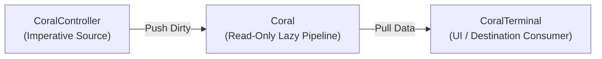

# 🚀 Coralline Quickstart & Core Concepts Guide

> **"Don't write boilerplates. To handle complex pipelines, all you have to do is call a line."**

Coralline is an elegant Dart/Flutter library designed to compose complex reactive pipelines and state management in a single line (**Call a line**) without computational overhead or boilerplate code.

This guide introduces app developers to Coralline's 3 core entities and the **Push-Dirty, Pull-Data** paradigm in 5 minutes.

<br><br>

### 1. The 3 Core Entities

A Coralline pipeline consists of 3 simple entities: **Source $\rightarrow$ Transformation $\rightarrow$ Destination**.



#### 1) `CoralController<T>` (Imperative Source)
- Positioned at the top of the pipeline to inject external data (UI clicks, network responses, WebSockets).
- Conceptually similar to `StreamController`, but does not continuously flood data downstream.
- Broadcasts only a lightweight **"Dirty Flag"** downstream.

#### 2) `Coral<T>` (Declarative Pipeline)
- A strictly **Read-only** reactive node that cannot be modified directly from the outside.
- Composable using operators like `.map()`, `.where()`, `.derive()`, `.cascade()`.
- Computations stay **Strictly Lazy** until downstream explicitly requests data.

#### 3) `CoralTerminal<T>` (Destination / UI Binding)
- Positioned at the bottom (Terminal) of the pipeline to display or gather data.
- **Parameterless `void Function() onDirty`**: Parameterless callback strictly separates **Signaling** (alerting the UI to schedule a rebuild) from **Data Extraction** (pulling snapshot data during the build tick). This prevents main-thread frame thrashing when background tasks emit high-frequency updates.
- **Mandatory Teardown (`terminal.deactivate()`)**: Always deactivate terminals inside `dispose()` or cleanup handlers to unbind upstream observers and prevent memory leaks.

<br><br>

### 2. Core Paradigm: Push-Dirty, Pull-Data & Source Bindings

Traditional reactive systems (Streams, Event-driven BLoCs) perform transformations eagerly whenever state changes. This wastes CPU cycles on invisible UI elements or intermediate calculations.

Coralline mirrors **Flutter's `RenderObject` rendering pipeline**:

```
[ Phase 1: Push-Dirty ]
controller.set(10) ---> Invalidate downstream _snapshots (O(1) lightweight notification)

[ Phase 2: Coalescing ]
100 state mutations within the same event loop are debounced into 1 invalidation

[ Phase 3: Pull-Data ]
UI render cycle calls terminal.snapshot ---> Interrogate container (Valid/Empty/Damaged) & compute lazily
```

#### Heterogeneous Source Bindings (Sync, Async, Isolate)

Coralline seamlessly manages heterogeneous upstream data sources without UI thread starvation:
- **Synchronous In-Memory Binding** (`CoralController`, `Coral.value`): Immediately returns `Valid` snapshot; dispatches dirty signals synchronously.
- **Asynchronous I/O Binding** (`CoralController.async`, REST API, WebSockets): 3-stage lifecycle transition (`Empty` pending $\rightarrow$ `Valid` payload / `Damaged` error). Eliminates `null` ambiguity.
- **Parallel Isolate Worker Binding** (CPU-heavy encoding, ML): Offloads computations to background Dart Isolates via `SendPort`/`ReceivePort`, guaranteeing 60/120fps UI thread safety.

<br><br>

### 3. Practical Examples

#### Example 1: Form Field Validation Pipeline

```dart
import 'package:coralline/coralline.dart';

class LoginFormState {
  final emailController = CoralController<String>('');
  final passwordController = CoralController<String>('');

  late final Coral<bool> isEmailValid;
  late final Coral<bool> isPasswordValid;
  late final Coral<bool> isFormValid;

  LoginFormState() {
    isEmailValid = emailController.coral.map((email) => email.contains('@'));
    isPasswordValid = passwordController.coral.map((pw) => pw.length >= 8);
    isFormValid = isEmailValid.combine(
      isPasswordValid, 
      (emailOk, pwOk) => emailOk && pwOk,
    );
  }
}

void main() {
  final form = LoginFormState();
  late final CoralTerminal<bool> terminal;
  terminal = form.isFormValid.toTerminal(() {
    scheduleMicrotask(() {
      print('Login button enabled: ${terminal.data}');
    });
  });
  terminal.activate();

  form.emailController.set('user@example.com');
  form.passwordController.set('secret1234');
}
```

#### Example 2: Async Search & `CoralSnapshot` Pattern Matching

```dart
import 'package:coralline/coralline.dart';

void main() async {
  final queryController = CoralController<String>('');

  final searchPipeline = queryController.coral.cascade((query) {
    if (query.isEmpty) return Coral.data(<String>[]);
    return fetchSearchResults(query).toCoral();
  });

  late final CoralTerminal<List<String>> terminal;
  terminal = searchPipeline.toTerminal(() {
    scheduleMicrotask(() {
      switch (terminal.snapshot) {
        case CoralSnapshotValid(:final data):
          print('Search results: $data');
        case CoralSnapshotEmpty():
          print('Please enter a search query...');
        case CoralSnapshotDamaged(:final error):
          print('Error loading search: $error');
      }
    });
  });
  terminal.activate();

  queryController.set('Flutter');
}
```

<br><br>

### 4. Summary & Next Steps

- **CoralController**: Imperative data source
- **Coral**: Read-only lazy pipeline
- **CoralTerminal**: UI/Destination pull point

Next: 🔀 [Pipeline & Broadcasting Guide](02_pipeline_and_broadcasting.md) to learn about 1:N sharing and dynamic topology (`CoralCoupler`).
