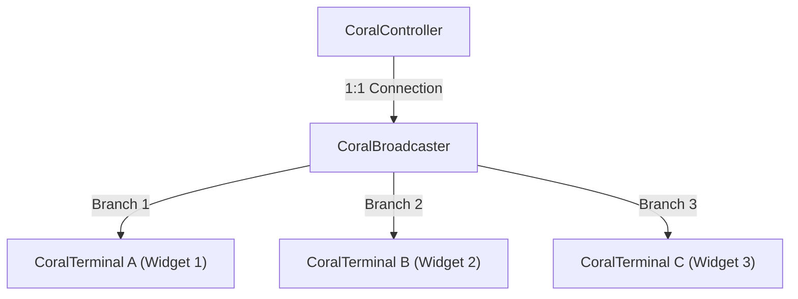

# 🔀 Pipeline Composition & Broadcasting Guide

Coralline enforces a strict **1:1 pipeline connection** by default to guarantee zero-overhead performance. However, real-world apps often require sharing a single data source across multiple UI widgets or swapping data pipelines dynamically at runtime.

This guide explains **1:N Broadcasting**, **Dynamic Topology Swapping (`CoralCoupler`)**, and **Snapshot Error Defense**.

<br><br>

### 1. 1:1 Pipeline vs 1:N Broadcasting

#### Why 1:1 by Default?
To eliminate complex runtime object tracking, Coralline links default `Coral` nodes in a strict 1:1 pipeline. If a second `Terminal` attempts to subscribe to a 1:1 node, Coralline immediately throws a `CoralNodeReleaseViolationException`.

#### 1:N Pipeline Sharing with `CoralBroadcaster`

When a single source must be shared by multiple consumers, use `broadcast()` or `CoralBroadcaster`.



```dart
import 'package:coralline/coralline.dart';

void main() {
  final controller = CoralController<int>(0, broadcast: true);

  late final CoralTerminal<int> terminalA;
  late final CoralTerminal<int> terminalB;
  terminalA = controller.coral.toTerminal(() => scheduleMicrotask(() => print('Terminal A: ${terminalA.data}')));
  terminalB = controller.coral.toTerminal(() => scheduleMicrotask(() => print('Terminal B: ${terminalB.data}')));

  terminalA.activate();
  terminalB.activate();

  controller.set(42);
}
```

<br><br>

### 2. Reference Counting & Lazy Deactivation

`CoralBroadcaster` tracks downstream subscriber count in real time:

1. **1st Subscriber Added**: Activates upstream resources and starts computing.
2. **Subscribers Hit 0**: Gracefully deactivates upstream resources.

#### 💡 Microtask Lazy Deactivation (`lazyDeactivation = true`)
During Flutter Hot Reloads or route transitions, widgets are unmounted and remounted rapidly. Deactivating resources immediately causes UI flickering and redundant re-initialization costs.

Coralline defers deactivation to the end of the microtask queue. If a new widget subscribes within the same frame, the upstream pipeline stays alive, guaranteeing **zero-flicker UI updates**.

<br><br>

### 3. Dynamic Pipeline Swapping & Dynamic Operators

Coralline elevates upstream nodes from passive data providers to **Pipeline Injectors**, enabling dynamic topology reconstruction at runtime.

#### Simple Swapping: `CoralCoupler`
When swapping data sources at runtime (e.g. Local DB $\rightarrow$ Remote Server API), use `CoralCoupler`:
```dart
final coupler = CoralCoupler<String>(initialSourceCoral);
late final CoralTerminal<String> terminal;
terminal = coupler.coral.toTerminal(() => scheduleMicrotask(() => print(terminal.data)));
terminal.activate();

// Hot-swap pipeline source dynamically!
coupler.couple(newSourceCoral);
```

#### Core Dynamic Operators (`cascade`, `diverge`, `converge`)

```
[ Cascade (1:1 Swapping) ]    Coral<S>  ───────> Coral<T>
[ Diverge (1:N Divergence) ]  Coral<S>  ───────> Trunk<T> (Bundle of Coral<T>)
[ Converge (N:1 Merger) ]     Trunk<S>  ───────> Coral<T>
```

1. **`cascade` (1:1 Dynamic Swapping)**: Swaps a single downstream `Coral<T>` pipeline in response to changes in upstream `Coral<S>` (e.g. user ID change triggering fetch).
2. **`diverge` (1:N Dynamic Divergence)**: Evaluates single payload `S` to dynamically yield a collection of $N$ child `Coral<T>` lines bundled in a `Trunk<T>`.
3. **`converge` (N:1 Dynamic Convergence)**: Watches an $N$-line `Trunk<S>` and aggregates them into a single downstream `Coral<T>`.

#### Diverge-Converge Diamond Topology (Split-Merge Pattern)
Combining `diverge` and `converge` forms a Diamond Topology where a single state splits into $N$ parallel dynamic branches and merges back cleanly:
```
                                               ┌──> [Child Coral<T> 1] ──┐
[Source Coral<S>] ──> .diverge() ──> [Trunk<T>] ──┼──> [Child Coral<T> 2] ──┼──> .converge() ──> [Result Coral<R>]
                                               └──> [Child Coral<T> N] ──┘
```

#### Dirty Push Suppression (`_suppressedDirtyPushCount`)
During dynamic line swapping, secondary dirty cascades are suppressed by `_suppressedDirtyPushCount`, coalescing nested topology changes into a single downstream notification and preventing infinite cascade loops.

#### Hotswap vs Coldswap
- **Coldswap (`hotswap: false`, default)**: Immediately disconnects old node for GC memory cleanliness.
- **Hotswap (`hotswap: true`)**: Keeps old node alive via `_MooringPoint` until new node completes connection, avoiding UI data gaps.

<br><br>

### 4. `CoralSnapshot` & Error Defense

Coralline packages all pipeline data in an immutable `CoralSnapshot<T>` struct:

- **`CoralSnapshotValid<T>`**: Valid data payload.
- **`CoralSnapshotEmpty<T>`**: Uninitialized state.
- **`CoralSnapshotDamaged<T>`**: Computation exception state (`error`, `stackTrace`).

#### 3 Defense Principles (`Guarded`, `Optimistically`, `Safely`)
1. **`Guarded`**: Absorbs user computation errors into `CoralSnapshot.damaged` boxes gracefully.
2. **`Optimistically`**: Framework-internal atomic topology mutations without external user logic.
3. **`Safely`**: Catches errors during resource disposal and routes them to global error handlers.

<br><br>

### 5. Heterogeneous Mixed Source Synchronization & Merger Matrix

When synchronous in-memory, asynchronous I/O, and parallel Isolate sources converge at a `Trunk.combine()` or `Trunk.converge()` node, the standard evaluation model applies:

| Source A (Sync) | Source B (Async I/O) | Source C (Parallel Isolate) | Standard Combination (`combine`) | Downstream Snapshot |
| :--- | :--- | :--- | :--- | :--- |
| **Valid** | **Empty** (Pending) | **Empty** (Processing) | Execution Suspended | **`CoralSnapshot.empty()`** |
| **Valid** | **Valid** | **Empty** (Processing) | Execution Suspended | **`CoralSnapshot.empty()`** |
| **Valid** | **Valid** | **Valid** | Composite Evaluation | **`CoralSnapshot.data(Payload)`** |
| **Valid** | **Damaged** | **Valid** | Fail-Fast Interception | **`CoralSnapshot.damaged(Error B)`** |

#### 💡 Developer Freedom in Custom Aggregation (`aggregate`)
- **Standard Bundling (`combine()`)**: Bundles data into `List<S>` when all participating lines resolve to `Valid`, following unified readiness and fail-fast interception rules.
- **Custom Aggregation (`aggregate` / `converge`)**: Passes raw node references (`Iterable<Coral<S>> lines`) directly to the developer's callback, granting **100% evaluation freedom**:
  - `lines.areAllValid()`: Compute only when every line is valid.
  - `lines.where((l) => l.isValid)`: Perform **Partial Aggregation** over currently valid lines while ignoring loading lines.
  - `line.dataOrNull`: Provide custom fallback values for uninitialized async lines.

<br><br>

### 6. Terminal Best Practices & Design Guidelines

#### ✅ Best Practices
1. **State-Guarded Extraction**: Interrogate `snap.isEmpty` and `snap.isDamaged` before accessing `.data`.
2. **Encapsulated Guard Pattern (`Coral.guard`)**: Protect lazy composite nodes by wrapping exposed coral getters:
   ```dart
   @override
   Coral<T> get coral => _guardCoral;
   late final Coral<T> _guardCoral = super.coral.guard(canProceed: () => iterateInbound().areAllValid());
   ```
3. **Mandatory Cleanup**: Always invoke `terminal.deactivate()` when unmounting widgets or tearing down services.

