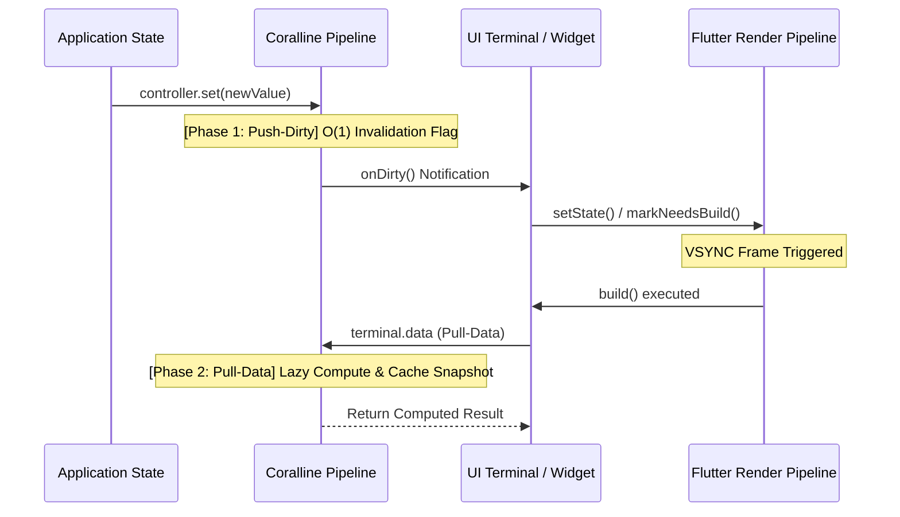
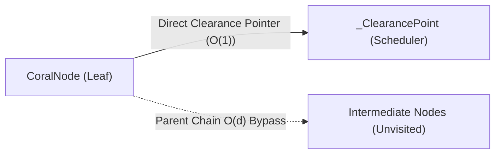
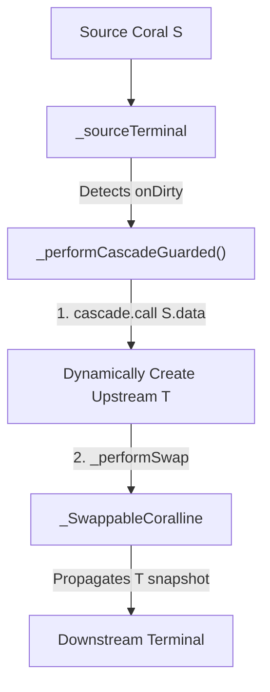

# 🔬 Engineering Whitepaper for Flutter & Dart Engineers

**Coralline Engine Architecture: Zero-Overhead Push-Dirty Pull-Data Reactivity & Fasttrack $O(1)$ Routing**

> **Author**: Youngjune Jeon  
> **Target Audience**: Flutter Framework Engineers, Dart VM/Compiler Engineers, Software Architects

<br><br>

### 1. Executive Summary

In modern declarative UI frameworks (Flutter, React, SwiftUI), one of the most critical engineering bottlenecks is **computational flooding**. Event-driven streams (Rx/Stream) or atomic signals push data transformations downstream eagerly, causing duplicate computations and frame drops (Jank) within a single event loop.

**Coralline** solves this bottleneck with a pure Dart reactive engine built on a **Push-Dirty, Pull-Data** architecture and **Fasttrack $O(1)$ Direct Pointer Bypass**, 100% mirrored from Flutter's low-level rendering pipeline (`RenderObject`).

<br><br>

### 2. Structural Mirroring with Flutter `RenderObject` Pipeline

Flutter maintains smooth 60-120 FPS frame rates by lazily evaluating layout operations.



#### Architecture Comparison

| Concept | Flutter Render Pipeline (`RenderObject`) | Coralline Pipeline (`CoralNode`) |
| :--- | :--- | :--- |
| **Invalidation Notice** | `markNeedsLayout()` (Flags dirty state only) | `_pushDirty()` (O(1) Snapshot invalidation) |
| **Coalescing Buffer** | Frame Scheduler holds build until VSYNC | Coalescing Phase (`_isDirtyPending` flag) |
| **Compute Execution** | Engine calls `performLayout()` backwards | `Terminal` calls `.data` / `.snapshot` |
| **Execution Frequency**| Exactly 1 converged pass per frame | Exactly 1 lazy compute pass per UI render |

<br><br>

### 3. Fasttrack $O(1)$ Routing (`_CorallineFasttrack`)

Traditional tree-based reactive engines traverse parent chains recursively during invalidation, causing **$O(d)$** ($d$=tree depth) overhead.

`_CorallineFasttrack` pre-caches clearance points at structural topology mutation time ($O(\text{subtree})$), reducing runtime state update notification cost to **$O(1)$**.



- `_clearancePoint`: Direct $O(1)$ reference to nearest clearance point.
- **Short-circuit Pruning**: Stops top-down topology rerouting immediately if cached clearance matches previous value.

<br><br>

### 4. Zero-Overhead Assertions in Release Builds

Framework invariant checks (DAG cycle checks, intent firewalls, 1:1 ownership checks) protect developers during development, but must incur **0.00% overhead** in production release builds.

```dart
// Actual internal integrity assertions in Coralline (lib/src/node.dart & _computation.dart)
assert(
  !joint._debugIterateDownstream()._containsIdentical(this),
  'A cyclic attachment was detected: target joint already forwards to this coralNode.',
);

assert(() {
  for (final forward in _debugIterateDownstream()) {
    if (forward is _IntentFirewall) {
      throw CorallineTopologyError(
        'Topology Error: CorallineTerminalIntentAware computation is placed upstream of a CoralBroadcaster.',
      );
    }
  }
  return true;
}());
```

- **Release Build Optimization**: Dart AOT compiler strips `assert` blocks completely in release mode.
- **Pure Dart 3 & Wasm Ready**: Zero dependencies on `dart:ui` or `flutter/widgets.dart` in the core engine. Fully optimized for Dart Wasm compilation.

<br><br>

### 5. The Signaling vs Data Extraction Paradigm

In traditional Push-Data engines (RxDart, Streams), emitting a new payload forces immediate downstream callback invocation. Under high-frequency background events (e.g. 1,000 updates/sec from an isolate), the main thread executes transformation callbacks 1,000 times, causing main-thread frame thrashing (Jank).

Coralline decouples **Signaling** (`onDirty`) from **Data Extraction** (`snapshot` / `data`):
1. **Push-Dirty (`onDirty`)**: A parameterless `void Function()` callback. Its sole job is to notify Flutter's engine to schedule a render tick (`setState` / `markNeedsBuild`).
2. **Coalescing**: Flutter batches 1,000 dirty notifications into a single VSYNC render tick.
3. **Pull-Data (`snapshot`)**: The widget's `build()` method pulls the snapshot synchronously on the VSYNC tick. Intermediate payloads are safely ignored without ever materializing in memory or wasting CPU cycles.

#### `ComplexComputation` & Encapsulated State Guards (`Coral.guard`)
Lazy N:1 composite nodes like `ComplexComputation` evaluate upstream dependencies on demand. If an uninitialized upstream node yields an `Empty` snapshot during evaluation, extracting `.data` throws a `CoralSnapshotExtractionException`, mutating an expected `Empty` state into `Damaged`.

To protect downstream nodes architecturally without polluting UI logic with defensive `if-else` guards, Coralline provides **Declarative Encapsulated Guards**:
```dart
abstract base class CustomDataAggregator<T> extends ComplexComputation<T> {
  // 1. Define safety condition
  bool canProceed() => iterateInbound().areAllValid();

  // 2. Encapsulate shield within getter
  @override
  Coral<T> get coral => _guardCoral;
  late final Coral<T> _guardCoral = super.coral.guard(canProceed: canProceed);
}
```

<br><br>

### 6. Dynamic Upstream Line Injection & Structural Swapping Mechanics

`_CascadingCoralline<S, T>` elevates upstream nodes to **Pipeline Injectors (Meta Controllers)** capable of dynamically restructuring downstream DAG topology at runtime.

#### Dynamic Swapping Sequence & Dirty Suppression



To prevent infinite dirty signal cascades during structural graph mutations, `_CascadingCoralline` employs `_suppressedDirtyPushCount`:
- Increments `_suppressedDirtyPushCount` prior to dynamic line instantiation.
- Coalesces duplicate intermediate dirty notifications into a single atomic downstream signal.

<br><br>

### 7. Heterogeneous Source Evaluation & Isolate Offloading Architecture

Coralline unifies synchronous in-memory state, asynchronous I/O streams, and multi-threaded background Isolates into a single deterministic DAG evaluation engine:

```
┌────────────────────────────────────────────────────────────────────────────────────────────────┐
│                         Coralline Heterogeneous Source Binding Spectrum                        │
├────────────────────────────────┬───────────────────────────────┬───────────────────────────────┤
│ Synchronous In-Memory Binding  │ Asynchronous I/O Binding      │ Parallel Isolate Worker       │
├────────────────────────────────┼───────────────────────────────┼───────────────────────────────┤
│ • In-memory variables          │ • HTTP REST API & WebSockets  │ • Heavy CPU computation       │
│ • Immediate `Valid` snapshot   │ • 3-stage snapshot lifecycle  │ • Port messaging (Send/Receive)│
│ • Zero evaluation latency      │ • Eliminates null ambiguity   │ • Jank-free 60/120fps UI      │
└────────────────────────────────┴───────────────────────────────┴───────────────────────────────┘
```

- **Off-Thread Isolate Concurrency**: Heavy JSON parsing, ML inference, or cryptography runs on isolated Dart memory heaps. When results post via `SendPort`, the main thread's `ReceivePort` transitions the node snapshot to `Valid` and emits a single `onDirty` ping.
- **Fail-Fast Interception**: At convergence nodes (`Trunk.combine()`, `Trunk.converge()`), if any single inbound source (whether sync, async, or isolate) encounters an exception, processing halts immediately and forwards `CoralSnapshot.damaged(error)` downstream.

