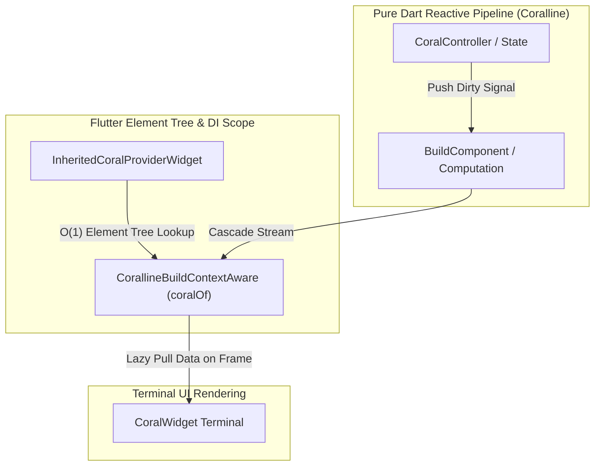
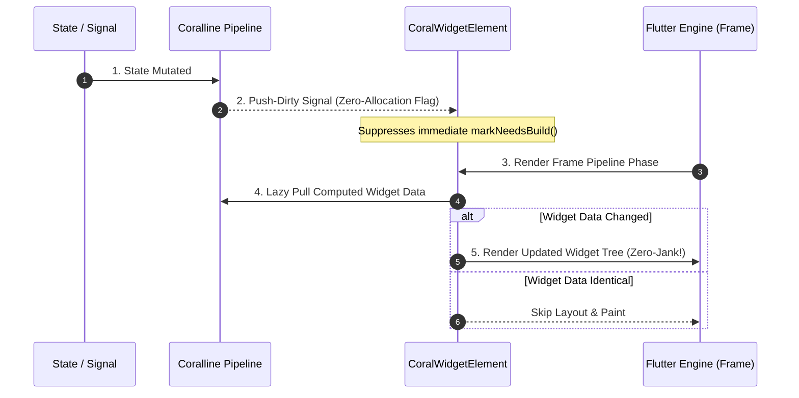

# Coralline Flutter

[](https://pub.dev/packages/coralline_flutter)
[](LICENSE)
[](https://flutter.dev)

> **"Seamlessly bridge pure Dart reactive pipelines with Flutter's element tree."**  
> *Zero-allocation single-stream components, $O(1)$ context dependency resolution, and lazy push-dirty pull-data widget rebuilds.*

**Coralline Flutter** (`coralline_flutter`) is a declarative, high-performance Flutter state management library and design pattern implementation built on **Coralline**'s **Chain of Reactivity** and **Lazy-computation Pipeline** (**CORAL**). It introduces zero-allocation single-stream UI components, automatic $O(1)$ context dependency resolution, and lazy push-dirty pull-data widget rebuilds directly inside Flutter's rendering pipeline.

<br><br>

## 🌟 Key Features

- ⚡ **Zero-Allocation Single Dependency (`SimplexBuildComponent`)**: Ultra-optimized 1:1 binding between a reactive node and a UI component.
- 🔗 **Multi-Dependency Reactive UI (`BuildComponent`)**: Pure, topological N:1 reactivity that updates widgets lazily only when declared upstream nodes emit dirty signals.
- 🌉 **Intent-Driven Context Propagation (`CorallineBuildContextAware`)**: Safely access `Theme`, `MediaQuery`, and `InheritedWidget`s inside reactive business logic without leaking context references or breaking purity.
- 💉 **Zero Prop-Drilling DI (`InheritedCoralProviderWidget` & `coralOf<T>()`)**: Seamlessly inject reactive providers into the Flutter element tree with $O(1)$ element tree lookups and cascade stream unwrapping.
- 🎬 **Resilient Animations without `StatefulWidget` (`ResilientAnimationController` & Ticker Mixins)**: Drive Flutter animations natively within pure business components without leaking memory or requiring `StatefulWidget` boilerplate.
- 🎯 **Push-Dirty, Pull-Data Efficiency**: Prevents unnecessary UI frame rendering and layout passes by computing widget trees strictly on demand.

<br><br>

## 📦 Getting Started

Add `coralline_flutter` to your `pubspec.yaml`:

```yaml
dependencies:
  flutter:
    sdk: flutter
  coralline: ^0.1.0
  coralline_flutter: ^0.1.0
```

Or run:

```bash
flutter pub add coralline_flutter
```

<br><br>

## 💡 Key Concepts

### 1. System Architecture & Flow Diagram

`coralline_flutter` seamlessly bridges pure Dart reactive pipelines with Flutter's element tree using a push-dirty, pull-data topology.



*(Zero-allocation signal propagation from pure Dart reactive nodes down to Flutter element terminals)*

### 2. Push-Dirty & Pull-Data Lazy Execution Flow

Unlike traditional state management solutions that force immediate, eager rebuilds across entire widget trees, `coralline_flutter` treats UI rendering as the **terminal stage** of a lazy, reactive data computation pipeline.



*(Pushes zero-allocation dirty flags during state mutation, pulling computed widget data strictly on VSYNC render frame)*

### 3. Topological Manifest (`@manifestSync`)

Components declare their upstream reactive dependencies explicitly via `manifest()`. This guarantees zero-over-fetching state synchronization and prevents ghost re-renders.

> [!NOTE]
> **🛡️ Intent Firewall (Structural Intent Isolation)**
> When a single reactive node is shared across multiple UI components (1:N topology), traditional MVI patterns can suffer from conflicting upstream intents. `coralline_flutter`'s topology structurally isolates upstream intents at broadcast split nodes (`CoralBroadcaster`), guaranteeing zero intent collisions without runtime filtering overhead.

<br><br>


## 🚀 Quick Start & Usage Examples

### Example 1: 1:1 Inline Reactive Binding (`.map(...).toWidget()`)

When a UI component depends on a single reactive signal node, you can concisely bind a reactive widget inline using `.map(...)` and `.toWidget()` without creating a separate class.

```dart
import 'package:flutter/material.dart';
import 'package:coralline_flutter/coralline_flutter.dart';

void main() => runApp(CounterApp());

class CounterApp extends StatelessWidget {
  CounterApp({super.key});

  // 1. Define reactive signal state
  final counterController = CoralController<int>(0);

  @override
  Widget build(BuildContext context) {
    return MaterialApp(
      home: Scaffold(
        appBar: AppBar(title: const Text('Simplex Counter Example')),
        body: Center(
          child: counterController.provider.coral
              .map((count) => Text(
                    'Count: $count',
                    style: const TextStyle(fontSize: 28, fontWeight: FontWeight.bold),
                  ))
              .toWidget(),
        ),
        floatingActionButton: FloatingActionButton(
          onPressed: () => counterController.set(counterController.data + 1),
          child: const Icon(Icons.add),
        ),
      ),
    );
  }
}
```

### Example 2: Multi-Dependency UI with `BuildComponent` (N:1 Binding)

Use `BuildComponent` when a UI subtree depends on **multiple** reactive streams (e.g., user profile + theme setting).

```dart
base class UserHeaderCard extends BuildComponent {
  UserHeaderCard({
    required this.usernameCoral,
    required this.unreadCountCoral,
  });

  final Coral<String> usernameCoral;
  final Coral<int> unreadCountCoral;

  @override
  @manifestSync
  Iterable<CoralNode> manifest() => [usernameCoral, unreadCountCoral];

  @override
  Widget build() {
    return Card(
      child: ListTile(
        title: Text('Welcome back, ${usernameCoral.data}!'),
        trailing: Badge(
          label: Text('${unreadCountCoral.data}'),
        ),
      ),
    );
  }
}
```

### Example 3: Context-Aware Business Component (`CorallineBuildContextAware`)

Access Flutter's `BuildContext` (Theme, MediaQuery, InheritedWidgets) directly inside reactive computations without breaking purity.

```dart
base class ThemedStatusBadge extends BuildComponent with CorallineBuildContextAware {
  ThemedStatusBadge({required this.statusMessage});

  final Coral<String> statusMessage;

  // Reactively derive Theme from Flutter's BuildContext
  late final themeCoral = context.map((ctx) => Theme.of(ctx)).distinct();

  @override
  @manifestSync
  Iterable<CoralNode> manifest() => [statusMessage, themeCoral];

  @override
  Widget build() {
    final theme = themeCoral.data;
    return Container(
      padding: const EdgeInsets.all(12.0),
      color: theme.colorScheme.primaryContainer,
      child: Text(
        statusMessage.data,
        style: TextStyle(color: theme.colorScheme.onPrimaryContainer),
      ),
    );
  }
}
```

### Example 4: Dependency Injection via `InheritedCoralProvider` & `coralOf<T>()`

Inject reactive state into the widget tree and read it from any descendant component without prop-drilling.

```dart
// 1. Domain model & internal reactive signals definition
class AppUser {
  AppUser(this.name);
  final String name;

  // Reactive controller pipeline for unread message count (broadcast: true for multi-subscriber UI binding)
  final unreadCountController = CoralController<int>(3, broadcast: true);
  Coral<int> get unreadCountCoral => unreadCountController.coral;

  // Reactive controller pipeline for shopping cart item count (broadcast: true for multi-subscriber UI binding)
  final cartItemCountController = CoralController<int>(5, broadcast: true);
  Coral<int> get cartItemCountCoral => cartItemCountController.coral;
}

// 2. Inject reactive state at the root of your app
Widget buildApp(CoralProvider<AppUser> userProvider) {
  return InheritedCoralProviderWidget<AppUser>(
    provider: userProvider,
    child: const UserProfilePage(),
  );
}

// 3. Consume state anywhere in descendant tree and flatten inner pipelines (Cascade)
base class UserGreeting extends BuildComponent with CorallineBuildContextAware {
  // Automatically pull ancestor InheritedCoralProvider state and cascade-flatten its inner pipelines
  late final userCoral = coralOf<AppUser>();
  late final unreadCountCoral = coralOf<AppUser>().cascade((user) => user.unreadCountCoral);
  late final cartItemCountCoral = coralOf<AppUser>().cascade((user) => user.cartItemCountCoral);

  @override
  @manifestSync
  Iterable<CoralNode> manifest() => [userCoral, unreadCountCoral, cartItemCountCoral];

  @override
  Widget build() {
    final user = userCoral.data;
    final unreadCount = unreadCountCoral.data;
    final cartItemCount = cartItemCountCoral.data;
    return Text('Hello, ${user.name}! (Messages: $unreadCount | Cart: $cartItemCount)');
  }
}
```

### Example 5: Resilient Animations without `StatefulWidget` (`ResilientAnimationController`)

Drive high-performance Flutter animations directly within reactive business components without `StatefulWidget` boilerplate or ticker leaks.

```dart
base class ExpandablePanel extends ComplexComputation<Widget>
    with
        CorallineLifecycleAware,
        CorallineTerminalIntentAware,
        CorallineBuildContextAware,
        SingleTickerProviderCorallineLifecycleAwareMixin {
  ExpandablePanel({required this.child});

  final Widget child;

  static final Animatable<double> _expansionTween = CurveTween(
    curve: Curves.easeInOut,
  );

  // 1. Initialize ResilientAnimationController using `this` as vsync TickerProvider
  late final controller = ResilientAnimationController(
    duration: const Duration(milliseconds: 300),
    vsync: this,
  );

  // 2. Drive tween animation transform
  late final animation = controller.drive(_expansionTween);

  @override
  @manifestSync
  Iterable<CoralNode> manifest() => [controller.coral];

  @override
  Widget build() {
    // 4. Render smooth animated size transition
    return SizeTransition(
      sizeFactor: animation,
      child: child,
    );
  }
}
```

### Example 6: Fault-Tolerant Pipeline Safety with `errorBuilder`

Prevent red error screens or app crashes when reactive pipelines encounter runtime exceptions (e.g. network failure, null reference, damaged state) by supplying a fallback `errorBuilder`.

```dart
base class UserProfileCard extends BuildComponent {
  UserProfileCard({required this.userProfileCoral});

  final Coral<UserProfile> userProfileCoral;

  @override
  @manifestSync
  Iterable<CoralNode> manifest() => [userProfileCoral];

  @override
  Widget build() {
    // If userProfileCoral computation enters a damaged state, errorBuilder catches it
    final profile = userProfileCoral.data;
    return ListTile(
      title: Text(profile.name),
      subtitle: Text(profile.email),
    );
  }
}

// Convert to widget with an error fallback safety net
Widget buildSafeUserCard(UserProfileCard component) {
  return component.toWidget(
    errorBuilder: (context, error, stackTrace) {
      return Container(
        padding: const EdgeInsets.all(16.0),
        color: Theme.of(context).colorScheme.errorContainer,
        child: Text(
          'Failed to load user profile: $error',
          style: TextStyle(color: Theme.of(context).colorScheme.onErrorContainer),
        ),
      );
    },
  );
}
```

> **💡 Pro Tip: App-Wide Shared Fallback Extension Pattern**
> Create a project-specific extension (e.g. `toAppWidget()`) to encapsulate your design system's default error UI and logging (e.g. Sentry, Firebase) globally across your entire app:
> ```dart
> extension AppCoralWidgetExtension<T extends CoralComputation<Widget>> on T {
>   CoralWidget toAppWidget({
>     Key? key,
>     Widget Function(BuildContext context, Object error, StackTrace? stackTrace)? errorBuilder,
>   }) {
>     return toWidget(
>       key: key,
>       errorBuilder: errorBuilder ?? (context, error, stackTrace) {
>         return AppStandardErrorWidget(error: error); // Shared Design System Fallback
>       },
>     );
>   }
> }
> ```

<br><br>

## 🔍 Deep Dive: Structural Comparisons

### 1. State Management & DI: Traditional Provider vs InheritedCoralProvider

`InheritedCoralProvider` & `coralOf<T>()` provides Dependency Injection (DI) and state propagation that fundamentally differs from traditional Flutter state management solutions like `package:provider` or raw `InheritedWidget`s in **architecture**, **rebuild execution**, and **context coupling**.

#### 📊 Feature Comparison Matrix (Native `InheritedWidget` vs `package:provider` vs Coralline)

| Feature | Native Flutter<br>`InheritedWidget` | Traditional<br>`package:provider` | Coralline Provider<br>(`InheritedCoralProvider` + `coralOf<T>()`) |
| :--- | :--- | :--- | :--- |
| **Execution Paradigm** | **Push-Rebuild (Eager)**<br>`updateShouldNotify` forces immediate `markNeedsBuild()` across client elements. | **Push-Rebuild (Eager)**<br>`notifyListeners()` eagerly schedules client element rebuilds. | **Push-Dirty, Pull-Data (Lazy)**<br>Propagates zero-allocation dirty signals, computing UI strictly at frame render time. |
| **`BuildContext` Coupling** | **Tightly Coupled to UI**<br>Must call `context.`<br>`dependOnInheritedWidgetOfExactType`<br>inside `build(context)`. | **Tightly Coupled to UI**<br>Must call `context.watch<T>()`<br>inside `Widget.build(context)`. | **Decoupled to Business Fields**<br>Declared as reactive fields in business classes via `CorallineBuildContextAware`<br>(`coralOf<T>()`). |
| **Tree & State Transitions** | Manual listener re-registration on ancestor relocation. | Re-instantiating providers forces client element re-subscriptions and full widget rebuilds. | **Cascade Stream Flattening**<br>Automatically flattens tree position changes and inner `Coral<T>` data changes into a unified stream. |
| **Tree Lookup Mechanics** | **$O(1)$ Native Lookup**<br>Uses Flutter engine's<br>`_inheritedElements` HashMap. | **$O(1)$ Native Lookup**<br>Leverages underlying<br>`InheritedWidget` HashMap mechanics. | **$O(1)$ Native Lookup (100% Inherited)**<br>Inherits native $O(1)$ lookup while suppressing forced-rebuild notifications. |

#### 🔄 Architectural Flow Comparison

```
[ Traditional Provider (Push-Rebuild) ]
State Update 
  └─► notifyListeners() 
        └─► InheritedElement.notifyClients() 
              └─► Element.markNeedsBuild() (Immediate Rebuild Scheduled)
                    └─► Widget.build(context) (UI Re-computation & Rendering)

[ coralline_flutter (Push-Dirty, Pull-Data Lazy Pipeline) ]
State Update 
  └─► Push-Dirty Signal Propagation (Zero-allocation flag update)
        └─► Flutter Frame Pipeline Triggered
              └─► Terminal Pulls Computed Data Lazily
                    └─► Rebuilds ONLY if computed Widget output actually changes
```

#### 🛡️ Core Advantages of `coralOf<T>()`

1. **Push-Dirty, Pull-Data Lazy Computation**: Avoids eager widget tree re-evaluations upon every state mutation. Computations run on demand during the frame phase, eliminating UI jank and unnecessary render passes.
2. **Context Decoupling via Intent Architecture**: Eliminates `BuildContext` memory leaks and stale context bugs by passing context via reactive Intent streams without storing element references inside business logic.
3. **Automatic Cascade Stream Flattening**: `coralOf<T>()` internally evaluates:
   $$\text{coralOf<T>()} = \text{dependOn<InheritedCoralProviderWidget<T>>()}.\text{cascade}((\text{data}) \Rightarrow \text{data.provider.coral})$$
   It unifies both **ancestor widget tree transitions** and **inner state mutations** into a single, seamless `Coral<T>` stream.
4. **Topological Graph Guarantees**: Enforces dependency registration in `manifest()` (`@manifestSync`), preventing untracked state lookups and hidden cascade rebuilds.

#### 💡 Architectural Rationale: Why Inherit `InheritedWidget` & Override Rebuilds?

`coralline_flutter` does not reinvent a proprietary widget tree lookup mechanism. Instead, `InheritedCoralProviderWidget` directly extends Flutter's native `InheritedWidget` for 4 fundamental architectural reasons:

1. **$O(1)$ Engine-Level Lookup Performance**: Leverages Flutter engine's internal `_inheritedElements` HashMap via `dependOnInheritedWidgetOfExactType` for instant $O(1)$ ancestor lookups without $O(N)$ tree-walking overhead.
2. **Zero-Leak Element Lifecycle Management**: Automatically tracks and cleans up child element dependencies (`removeDependent`) when widgets unmount, completely eliminating ghost memory leaks common in global service locators.
3. **Seamless Flutter Ecosystem Compatibility**: Effortlessly bridges native Flutter UI context providers (`Theme`, `MediaQuery`, `Localizations`) into pure reactive `Coral<T>` nodes via `CorallineBuildContextAware`.
4. **Intuitive Scoped Dependency Injection**: Preserves familiar widget-tree-scoped DI patterns without requiring complex global container setups.

> **Summary**: `coralline_flutter` inherits 100% of `InheritedWidget`'s $O(1)$ lookup and lifecycle safety, while **intercepting and suppressing (`_suppressMarkNeedsBuild`) its inefficient forced-rebuild notification pipeline** to replace it with Coralline's lazy push-dirty pull-data pipeline.

<br><br>

### 2. Animation Engine: Traditional AnimationController vs ResilientAnimationController

`ResilientAnimationController` integrates Flutter's animation engine with Coralline's reactive resource lifecycle, eliminating memory leaks and StatefulWidget boilerplate.

#### 📊 Feature Comparison Matrix

| Feature | Traditional `AnimationController` | Coralline `ResilientAnimationController` |
| :--- | :--- | :--- |
| **Engine Instantiation** | **Eager (Immediate)**<br>Requires active ticker immediately upon creation. | **Lazy (On-Demand)**<br>Stays dormant until the reactive `Coral` pipeline is activated. |
| **Lifecycle & Resilience** | **Fragile State**<br>Disposing or deactivating drops state and parameters. | **State-Resilient**<br>Preserves values locally while dormant and seamlessly restores state on reactivation. |
| **Reactive Integration** | **UI Layer Only**<br>Restricted to `addListener()` or `AnimatedBuilder`. | **First-Class Reactive Node**<br>Implements `CoralProvider<double>` to pipe values directly into reactive computations. |
| **Multi-Subscriber** | **Manual Listener Handling**<br>Requires verbose listener management for multiple consumers. | **Built-in Broadcasting**<br>`broadcast: true` allows multiple subscribers to share one animation engine. |

<br><br>

### 3. Component Layer: Why `BuildComponent` Exists vs `StatelessWidget` / `StatefulWidget`

`BuildComponent` is **not** a traditional Flutter `Widget`. It is a pure Dart Coralline reactive computation node (`ComplexComputation<Widget>`) that exposes a Flutter-friendly `build()` interface.

#### 💡 Two Fundamental Reasons `BuildComponent` Exists

1. **Bridge Between Pure Dart Reactive Graphs and Flutter UI Trees**: Coralline's reactive engine operates in pure Dart. `BuildComponent` allows developers to write UI using familiar `build()` syntax while running natively inside Coralline's topological reactive graph.
2. **Topological Dependency Guarantees (`@manifestSync`)**: `StatelessWidget` and `StatefulWidget` cannot explicitly declare upstream data dependencies, causing unneeded ghost rebuilds when parent widgets update. `BuildComponent` enforces `manifest()`, ensuring UI subtrees compute strictly when declared upstream nodes emit dirty signals.

<br><br>

### 4. Architectural Comparison: Coralline vs BLoC vs Riverpod vs Signals

Coralline Flutter's paradigm can be formally classified as a **Lazy-Computed Topological Reactive DAG based on MVI**. Below is a comparative breakdown against other popular Flutter and reactive state management frameworks:

| Feature | Coralline Flutter | BLoC | Riverpod | Signals (Preact) |
| :--- | :--- | :--- | :--- | :--- |
| **Architecture** | **Lazy-Computed DAG + MVI** | Monolithic State + MVI | Provider Graph (DAG) | Reactive Primitives |
| **Data Propagation** | **Push-Dirty, Pull-Data (Lazy)** | Stream Push (Eager) | Eager / Microtask Push | Push-Dirty, Pull-Data |
| **Intent Handling** | **Upstream Intent + Firewall** | Sink Event Dispatch | Notifier Direct Calls | Direct Signal Mutation |
| **Rebuild Execution** | **Frame-Phase Lazy Pull** | Immediate Stream Listener | Immediate Invalidation | Direct Effect Trigger |
| **Safety & Control** | **Intent Firewall + `catchDamaged`** | Runtime Try/Catch | `AsyncValue` Catch | Exception Propagation |
| **Dynamic Hotswap** | **Native (`CoralCoupler` / `MooringPoint`)** | Manual Stream Rebind | `ref.watch` Dynamic Rebind | `effect` Re-track |

#### 💡 Key Architectural Takeaways

- **vs BLoC**: Inherits BLoC's unidirectionally decoupled **MVI** philosophy, but replaces monolithic state objects with fine-grained DAG nodes and shifts eager stream pushes into VSYNC frame-phase **lazy data pulls**.
- **vs Riverpod**: Inherits Riverpod's graph-based **DAG** topology, but replaces eager push propagation with $O(1)$ **zero-allocation dirty signals**, suppressing unnecessary widget rebuilds until frame rendering.
- **vs Signals**: Shares the same **push-dirty pull-data** primitive mechanics, but elevates it into an enterprise framework by introducing **upstream Intent propagation**, **Intent Firewall**, and dynamic **Hotswap** (`CoralCoupler`).

<br><br>


## 🛠️ Performance Best Practices

1. **Prefer `SimplexBuildComponent` for Single Streams**: When a component reads from only one reactive node, using `SimplexBuildComponent` avoids `Iterable`/`List` allocations entirely during topological binding.
2. **Cache Derived Nodes in `late final` Fields**: Avoid calling `context.map(...)` repeatedly inside `build()` or `compute()`. Always store derived broadcaster line nodes in `late final` fields.
3. **Use `.toWidget()` Helper**: Convert your `BuildComponent` or `Coral<Widget>` into a Flutter `Widget` using `.toWidget()` for standard, fluid Flutter composition.

<br><br>

## 📄 License

Coralline Flutter is open-source software licensed under the [Apache 2.0 License](LICENSE).  
Copyright 2023-2026 Youngjune Jeon All rights reserved.
